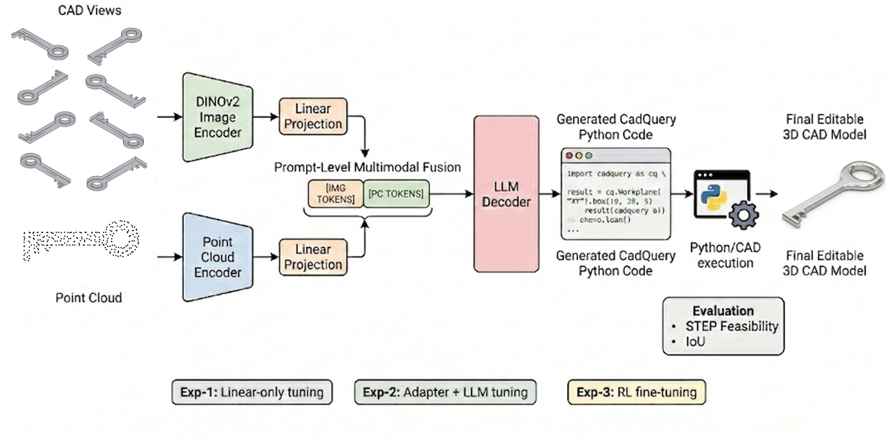
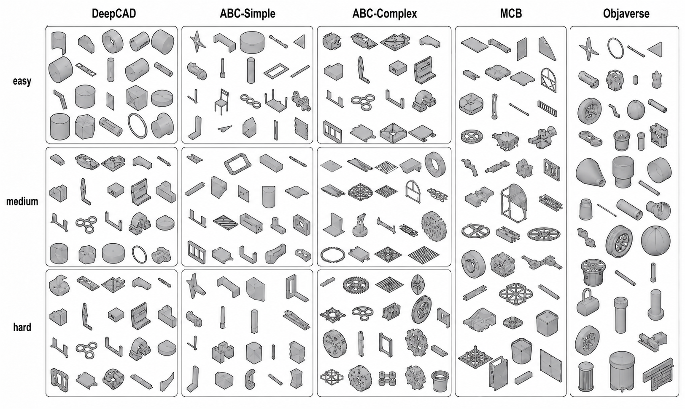
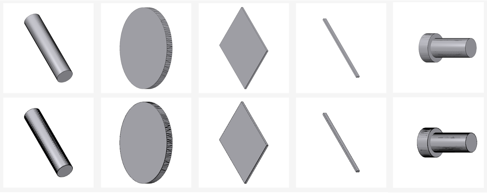
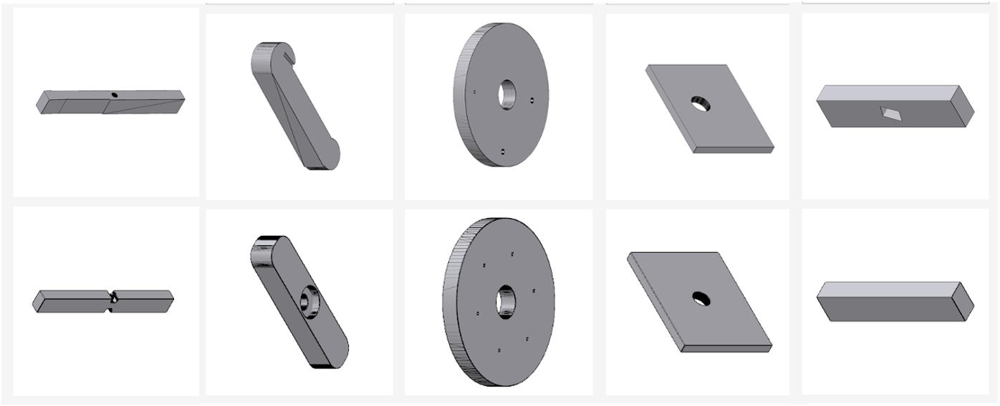
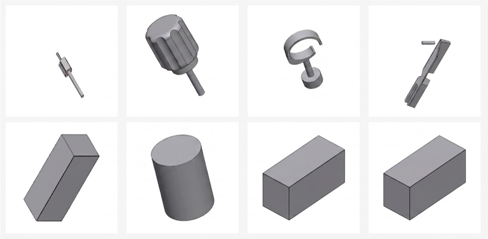

# Trimodal CAD

**Multimodal CAD code generation from images and point clouds.**

This repository accompanies the paper *Multimodal CAD Code Generation from Images and Point Clouds* (Sung & Doris, MIT) and contains the implementation, training scripts, and supporting materials for a projection-only multimodal CAD generator that conditions a frozen language model on both rendered views and 3D point clouds.

The full paper PDF lives at [docs/multimodal_cad_report.pdf](docs/multimodal_cad_report.pdf).



*Multi-view rendered images go through a frozen DINOv2 encoder; sampled point clouds go through a frozen Fourier point encoder. Both modality streams are mapped into the LLM embedding space by small trainable MLP projectors, concatenated as a multimodal prefix, and decoded autoregressively into executable CadQuery Python code. Generated programs are executed and exported through the CAD kernel for STEP feasibility and IoU evaluation.*

## Why multimodal?

Editable CAD generation is harder than ordinary 3D shape synthesis: the output must be *executable*, *parametric*, and *useful to engineers* after generation. Existing approaches sit at two extremes:

- **Image-only** systems such as CAD-Coder benefit from pretrained vision-language priors but must infer occluded geometry (rear faces, internal cuts, through-holes) from incomplete projections.
- **Point-cloud-only** systems such as CAD-Recode get an occlusion-free spatial scaffold but lack visual and semantic context.

The two modalities are complementary. This project tests a deliberately conservative question: *can cheap prefix-token multimodal alignment make a frozen CAD generator competitive with strong unimodal baselines?*

## Architecture

| Component       | Role                          | Model                                     | Trainable? |
|-----------------|-------------------------------|-------------------------------------------|------------|
| Vision encoder  | image → tokens (1×257×768)    | `facebook/dinov2-base`                    | frozen |
| Image projector | DINOv2 → LLM hidden (1536)    | 2-layer MLP w/ GELU                       | **trainable** |
| Point encoder   | XYZ → tokens (B×N×1536)       | Recode Fourier point encoder (8 bands)    | frozen |
| Point projector | Recode → LLM hidden (1536)    | 2-layer MLP w/ GELU                       | **trainable** |
| Decoder LLM     | tokens → CadQuery code        | `Qwen/Qwen2-1.5B` (hidden=1536)           | frozen (warmup) / trainable (joint, future) |

Multimodal prefix `[image_tokens ; point_tokens]` is concatenated before text embeddings. Labels at prefix positions are masked to `-100`, so loss is computed only on target CadQuery tokens. Trainable parameter set is ~8.26M — a small fraction of the full model.

Implementation: [hybrid_multimodal_stack/src/hybrid_multimodal_stack/model.py](hybrid_multimodal_stack/src/hybrid_multimodal_stack/model.py).

## Repository layout

```
trimodal-cad/
├── README.md                              ← this file
├── docs/
│   ├── multimodal_cad_report.pdf          ← full paper
│   ├── multimodal_cad_report.tex          ← LaTeX source
│   ├── references.bib
│   └── figures/                           ← overview + benchmark + qualitative figures
├── hybrid_multimodal_stack/               ← model implementation + training stack
│   ├── README.md                          ← detailed engineering README
│   ├── pyproject.toml, requirements.txt
│   ├── src/hybrid_multimodal_stack/       ← installable Python package
│   │   ├── config.py     (HybridConfig dataclass)
│   │   ├── model.py      (HybridCADStack: forward + generate)
│   │   ├── encoders.py   (DinoV2Encoder, RecodeFourierPointEncoder)
│   │   ├── projectors.py (MLPProjector)
│   │   ├── data.py       (CADMultimodalDataset + manifest builder)
│   │   ├── stages.py     (PROJECTOR_WARMUP / JOINT_FINETUNE freeze maps)
│   │   └── utils.py
│   ├── scripts/
│   │   ├── bootstrap_model.py
│   │   ├── extract_dinov2_base.py
│   │   ├── extract_recode_point_encoder.py
│   │   ├── train_multimodal.py            ← training loop
│   │   ├── train_two_adapters_orcd.sh     ← SLURM wrapper
│   │   ├── train_two_adapters_*.sbatch    ← cluster job scripts
│   │   ├── eval_forward_and_iou.py        ← greedy forward + best-IoU eval
│   │   └── eval_best_of_8_iou.py          ← best-of-8 sampling eval
│   ├── examples/forward_pass.py           ← single image+pointcloud inference demo
│   ├── configs/extracted_from_recode_notebook.yaml
│   └── outputs/
│       ├── recode_point_encoder.pt        ← frozen point encoder weights (committed)
│       └── train_run.tail.log             ← last 200 lines of training log
├── cad_recode_benchmark/                  ← CAD-Recode-style baseline & benchmark utils
├── evaluation_data/                       ← evaluation dataset preparation
├── training_data/                         ← training data preparation (CADEvolve)
└── hw5/                                   ← agent eval homework artifacts
```

## Data

The training corpus is built from **CADEvolve** (Elistratov et al., 2026) — a large executable CadQuery dataset with rendered geometry. We train from **923,104 CAD samples**, each contributing one CadQuery script, eight rendered views, and a 256-point point cloud. Pairing each rendered view with the same point cloud and target program yields **7,384,832 individual image–pointcloud–code rows**.

Three data roots on the cluster are joined by `case_id`:

| Root                                                   | What                                       |
|--------------------------------------------------------|--------------------------------------------|
| `CADEvolve-C_image_fresh_20260408/`                    | `view_{0..7}.png` per case                 |
| `CADEvolve-C_pointcloud/`                              | `<case>.npy` shape `[N,3]` per case        |
| `CADEvolve-C/`                                         | `<case>.py` CadQuery target code per case  |

Point clouds are reduced to 256 points with **deterministic farthest-point sampling** (seeded by the pointcloud path) so subsampling is reproducible across epochs.

## Training

All released weights come from the **`projector_warmup`** stage:

- **frozen:** DINOv2 backbone, Recode point encoder, Qwen2-1.5B decoder
- **trainable:** image MLP projector + point MLP projector

| Hyperparameter | Value |
|----------------|-------|
| Optimizer      | AdamW, lr=2e-4 |
| Grad clipping  | `max_norm=1.0` |
| Batch size     | 4 per GPU (effective 8 over 2 GPUs) |
| Mixed precision| fp32 model; adapters cast to LLM input dtype on the fly |
| Hardware       | 2× NVIDIA H100 via `torch.nn.DataParallel` |
| Wallclock      | ≈ 3 weeks |
| Final step     | 1,230,000 |

Training history → final checkpoint:

| Run dir                                           | Steps             | Notes |
|---------------------------------------------------|-------------------|-------|
| `train_two_adapters_node2435_12029506`            | 10k → 300k        | first long run from scratch |
| `train_two_adapters_resume_300k_12204250`         | 310k → **1.23 M** | resumed via `--resume-checkpoint` |

Reproducing the pipeline (from inside `hybrid_multimodal_stack/`):

```bash
# 1) one-time encoder extraction
PYTHONPATH=src python scripts/extract_dinov2_base.py \
    --model facebook/dinov2-base --output-dir outputs/dinov2-base
PYTHONPATH=src python scripts/extract_recode_point_encoder.py \
    --recode-model filapro/cad-recode-v1.5 --output outputs/recode_point_encoder.pt

# 2) initial 100h training job (2× H100)
sbatch scripts/train_two_adapters_pi_faez_100h.sbatch

# 3) once a checkpoint exists, resume from the most recent one
sbatch scripts/train_two_adapters_continue_latest.sbatch
```

## Evaluation

Following the **CADBench** protocol, we evaluate on five suites totaling 15,000 samples. STEP-based families (DeepCAD, ABC-Simple, ABC-Complex) are stratified into Easy / Medium / Hard tiers by B-rep face count. Mesh-based families (MCB, Objaverse) are not face-count-tiered because tessellation density is not a reliable proxy for CAD modeling complexity.



| Benchmark      | # Samples | Stratification |
|----------------|-----------|----------------|
| DeepCAD        | 3,000     | E / M / H by face count |
| ABC-Simple     | 3,000     | E / M / H by face count |
| ABC-Complex    | 3,000     | E / M / H by face count |
| MCB            | 3,000     | flat |
| Objaverse      | 3,000     | flat (zero-shot) |

Two metrics are reported: **STEP feasibility** (% of generated programs that execute and export a valid STEP file) and **IoU** (geometric overlap between predicted and target shapes).

### Main results

| Model | Metric | DeepCAD-E | DeepCAD-M | DeepCAD-H | ABC-Simple-E | ABC-Simple-M | ABC-Simple-H | ABC-Complex-E | ABC-Complex-M | ABC-Complex-H | MCB | Objaverse |
|---|---|---:|---:|---:|---:|---:|---:|---:|---:|---:|---:|---:|
| **CAD-Coder** *(image-only)*       | STEP Feas. | 96.0 | 96.8 | 92.4 | 99.6 | 96.6 | 95.8 | 92.4 | 76.0 | 83.4 | 99.6 | 97.8 |
|                                    | IoU Mean   | 62.8 | 58.3 | 54.0 | 60.2 | 51.0 | 61.6 | 56.5 | 45.5 | 49.6 | 58.5 | 35.4 |
| **CAD-Recode** *(point-only)*      | STEP Feas. | 97.4 | 95.2 | 94.4 | 96.0 | 87.4 | 85.8 | 92.6 | 89.4 | 89.2 | 93.8 | 88.0 |
|                                    | IoU Mean   | 96.3 | 90.1 | 85.8 | 89.2 | 83.1 | 73.4 | 88.5 | 74.1 | 64.3 | 97.5 | 63.5 |
| **Ours** *(projection-only multimodal)* | STEP Feas. | 93.2 | 93.6 | **96.4** | 94.4 | 83.8 | 80.2 | **98.7** | **95.2** | **96.2** | 99.2 | **98.2** |
|                                    | IoU Mean   | 33.0 | 24.6 | 18.3 | 28.5 | 13.1 | 14.7 | 22.1 | 17.9 | 14.8 | 52.0 | 20.0 |

(Values are percentages; higher is better. Bold marks the best-of-three for that cell.)

### Interpretation

- **Executability is solid.** Our model averages **93.6% STEP feasibility**, with 9 of 11 settings above 93%. The frozen Qwen2 decoder retains valid CadQuery syntax even with new multimodal prefix conditioning.
- **Geometric IoU lags.** Producing syntactically valid CadQuery is a much weaker requirement than choosing the right construction planes, sketch profiles, feature dimensions, boolean operations, and repeated structures. The strongest IoU is on MCB (52.0% IoU @ 99.2% feasibility); other splits show that projector-only alignment captures coarse executable shape while missing operation-level structure.
- **Negative results are informative.** Projector-only tuning freezes the representations that must jointly solve geometry perception, cross-modal correspondence, program planning, and Python/CadQuery decoding. The next stages (deeper adapters + LoRA into the LLM, then CAD-aware reward optimization) are exactly where the IoU gap should close.

### Qualitative failure progression

| Easy | Medium | Hard |
|:---:|:---:|:---:|
|  |  |  |

Easy shapes are reconstructed almost exactly; medium shapes preserve the main body but lose refined features (holes, slots, small cuts); hard shapes with many surfaces collapse to coarse primitives even when the generated CadQuery remains executable.

## Quick inference

```bash
cd hybrid_multimodal_stack
pip install -e .

PYTHONPATH=src python examples/forward_pass.py \
    --image-path /abs/path/to/view_0.png \
    --pointcloud-path /abs/path/to/case.npy \
    --prompt "Write the CADQuery code for this object." \
    --max-new-tokens 256
```

For a minimal Python loader using the trained checkpoint, see [hybrid_multimodal_stack/README.md](hybrid_multimodal_stack/README.md#minimal-python-loader).

### Batch IoU eval (best-of-N on cadbench)

```bash
PYTHONPATH=src python scripts/eval_forward_and_iou.py \
    --image-root      /path/to/cadbench_stl_images \
    --pointcloud-root /path/to/cadbench_pointclouds_256 \
    --gt-step-root    /path/to/cadbench_steps_256 \
    --out-dir         ./outputs/eval_forward_iou
```

`eval_best_of_8_iou.py` does the same with 8 stochastic samples per case and keeps the best IoU.

## Trained weights

Two files exceed GitHub's 100 MB per-file limit and are **not** stored in this repo:

| File | Size | What |
|---|---:|---|
| `hybrid_multimodal_stack/outputs/dinov2-base/model.safetensors` | 331 MB | Frozen DINOv2-base vision backbone |
| `hybrid_multimodal_stack/outputs/final_model/checkpoint_step_1230000.pt` | 6.2 GB | Final projector-warmup checkpoint @ 1.23M steps |

Re-create them locally with the extraction scripts:

```bash
cd hybrid_multimodal_stack
PYTHONPATH=src python scripts/extract_dinov2_base.py \
    --model facebook/dinov2-base --output-dir outputs/dinov2-base
```

The trained projector checkpoint can be requested from the authors directly. The small **Recode point encoder** weights (316 KB) are committed at [hybrid_multimodal_stack/outputs/recode_point_encoder.pt](hybrid_multimodal_stack/outputs/recode_point_encoder.pt).

## Roadmap

The paper outlines three planned adaptation regimes; only Stage 1 is completed in the released checkpoint:

1. **Stage 1 — projector warmup** ✅ (released): only image + point projectors are trainable.
2. **Stage 2 — adapter + LLM fine-tuning** ⏳: unfreeze image/point adapters together with selected LLM layers (or LoRA into the decoder) so the model can reorganize attention around CAD-specific concepts.
3. **Stage 3 — RL fine-tuning** ⏳: post-SFT reward optimization with rewards for valid STEP export, single-solid validity, volumetric IoU, surface coverage, and operation-count compactness — inspired by CodeRL, Cadrille, and CADEvolve.

Missing single-modality controls (image-only and point-only inside this codebase) are also planned to cleanly attribute multimodal value vs. training-capacity limitations.

## Citation

```bibtex
@misc{sung2026trimodalcad,
  title  = {Multimodal CAD Code Generation from Images and Point Clouds},
  author = {Sung, Nicholas and Doris, Anna C.},
  year   = {2026},
  note   = {MIT Department of Mechanical Engineering. \url{https://github.com/nicksungg/trimodal-cad}}
}
```

## Acknowledgments

This work is built on top of [CAD-Recode](https://github.com/filapro/cad-recode), [CAD-Coder](https://github.com/anniedoris/CAD-Coder), [DINOv2](https://github.com/facebookresearch/dinov2), and Qwen2 by the Qwen team. CADEvolve provided the training corpus.
